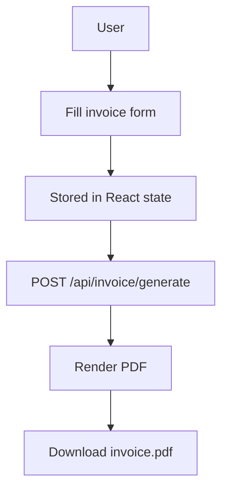

<div align="center">
  
  <h1>Bluemint</h1>
  <p><strong>The world's simplest invoice generator.</strong></p>
  
  <p>
    <a href="https://github.com/Ankitmohanty2/Bluemint-invoice">
      
    </a>
    
    
  </p>
</div>

<br />

Bluemint is a blazing-fast, self-hostable invoice generator built for freelancers, agencies, and small businesses. Create, customize, and download beautiful, professional invoices instantly—completely free, and without the hassle of signing up.

---

## ✨ Features

- **Lightning Fast:** Generate professional invoices directly in your browser.
- **Zero Friction:** No sign-up required, no monthly fees.
- **Client-Ready Designs:** Add your own logos, customize tax details, and present a polished brand.
- **Beautiful UI:** Premium, modern interface with full Dark Mode support.
- **Privacy First:** Your data stays in your browser state until the PDF is generated.
- **Multiple Invoice Types:** Support for both time-based (hourly) and product-based itemization.
- **Multi-Currency:** Bill clients in their local currency seamlessly.

---

## 🛠️ System Overview



**How it works:**
1. Invoice data is entered in the browser form.
2. The data stays securely in React state while the page is open.
3. When you click generate, the app sends the invoice data to the API route.
4. The API returns a polished PDF file.
5. The browser downloads the PDF locally to your machine.

---

## 💻 Tech Stack

- **Framework:** [Next.js](https://nextjs.org/) (App Router)
- **Styling:** [Tailwind CSS](https://tailwindcss.com/)
- **Components:** [Shadcn UI](https://ui.shadcn.com/)
- **Animations:** [Framer Motion](https://www.framer.com/motion/)

---

## 🚀 Getting Started

To run Bluemint locally, follow these steps:

1. **Clone the repository**
   ```bash
   git clone https://github.com/Ankitmohanty2/Bluemint-invoice.git
   cd Bluemint-invoice
   ```

2. **Install dependencies**
   ```bash
   npm install
   # or
   pnpm install
   # or
   yarn install
   ```

3. **Run the development server**
   ```bash
   npm run dev
   # or
   pnpm dev
   # or
   yarn dev
   ```

4. **Open your browser**
   Navigate to [http://localhost:3000](http://localhost:3000) to see the application running.

---

## 📜 License

**Copyright (c) 2026 Ankit Mohanty. All Rights Reserved.**

This software and its original source code, design, and branding are proprietary and confidential. You may not copy, modify, distribute, sell, or use this code, in whole or in part, without explicit written permission from the copyright holder.

For more details, please see the `LICENSE` file in the root directory.
